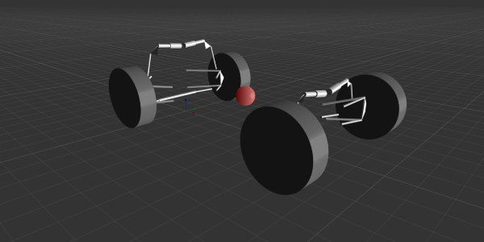
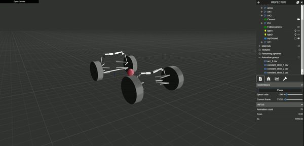

# **URAEUS** | FSAE

A multi-body systems' database for formula-style vehicles, such as those developed in the **FSAE** and the **Formula Student** competitions, implemented in the [**uraeus.mbd**](https://github.com/khaledghobashy/uraeus_mbd) open-source framework.

----------------

## Introduction

Formula Student is a series of competitions that challenge teams of university undergraduate and graduate students to conceive, design, fabricate, develop, and compete with small, formula-style vehicles.

The design of such vehicles requires a lot of efforts in many aspects, as it is a full real-life engineering project. One of the main technical challenges encountered in this project, is the adoption of engineering simulations to acquire valuable insights and accurate predictions of the vehicle performance in the various dynamics events.

These simulations can be categorized in various ways, such as their governing physical domains, i.e. Computational Fluid Dynamics, Finite Element Analysis, Thermal Analysis, Multi-Body Dynamics, Electromagnetism, etc.
While the real physical system encounters all these domains at once, it can be almost impossible to include all these interactions together in a single simulation instance. So, we adopt the concept of abstraction to simplify things out, in a sensible way, in order to achieve useful descriptions of the physical system that can be used to acquire valuable insights.

Vehicle dynamics is a major field of study when it comes to modelling and simulating vehicle performance regarding isolation and control. Traditionally, these performance aspects were analysed using classical vehicle dynamics approaches that are developed for ages and proved to be quite helpful and insightful.

Another way of approaching the problem is by treating the vehicle as a generic multi-body system, where the vehicle systems of interest are modelled as a set of rigid/flexible bodies connected together via joints, bushes and force elements. This approach can be considered as a high-fidelity modelling approach that abstracts the physical system in a more realistic -but complex- manner. This opens the doors for the next level of simulations ...

*To be Continued ...*

---

## About The Repository

*To-Do*

This repository aims to provide:

- A full-featured database of multi-body system models commonly used in developing **Formula Student** vehicles.
- A showcase of the **uraeus.mbd** open-source framework capabilities, and a "How To" use it in real-world modelling situations.
- A full-featured modelling and simulation process, i.e. model creation, numerical simulation and 3D visualization.

*3D vehicle model loaded in uraeus visualization environment.*

*Vehicle performing a tilt table test*

### Features

Currently, the database provides several ready-to-use symbolic models and assemblies, as well as a numerical simulation environment in python that can be used perform various types of numerical simulations. 

#### Symbolic Models
These are various template-based symbolic topologies that represent different multi-body mechanisms that can be found in a typical **Formula Student** vehicle. 
This is a list of the currently available topologies:

- **Suspension Mechanisms**:
  - Double Wishbone Direct-Acting mechanism
  - Double Wishbone Bellcrank-Actuated mechanism
- **Steering Mechanisms**:
  - Steering Rack
  - Parallel Link Steering
- **Vehicle Chassis**
  - Rigid Chassis

#### Symbolic Assemblies

Symbolic Assemblies are topologies that assemble various template-based models together, constructing a bigger multi-body system, such as full-vehicle assemblies and suspension test-rigs.

- **Full-vehicle Assembly**
  A symbolic assembly representing a full-vehicle with the following subsystems:
  - **Front Axle**
    Double Wishbone Bellcrank-Actuated mechanism
  - **Rear Axle**
    Double Wishbone Bellcrank-Actuated mechanism
  - **Rear Drive Shafts**
    Couplings drive shafts connected by universal joints.
  - **Front Steering**
    Steering Rack
  - **Vehicle Chassis**
    Rigid Chassis

---

## Approach

For insights about the general high-level modelling approach adopted by the **uraeus.mbd** , please read through the [**README**](https://github.com/khaledghobashy/uraeus_mbd/blob/master/README.md) first.